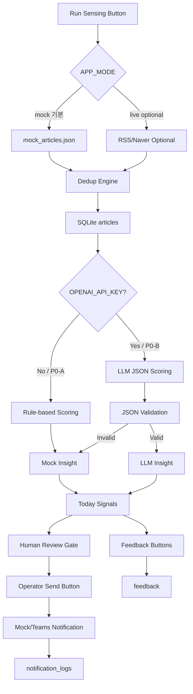

# 최종 PRD

# HDEC Executive Radar

## 현대건설 임원진을 위한 AI & Macro Sensing Agent

### Day-1 Safe Slim MVP + Day-2 Global X Signal Layer

본 PRD는 기획실 룰북의 “문서보다 실험”, “지표 중심”, “형용사 제거”, “PRD는 실험 설계 도구” 원칙을 따른다. Day-1 목표는 완성형 상용 서비스가 아니라 **몇 시간 안에 로컬에서 실제 작동하는 end-to-end walking skeleton**을 만드는 것이다. 

---

# 1. 제품 한 줄 설명

**HDEC Executive Radar**는 현대건설 임원진에게 중요한 AI·거시경제·건설산업 뉴스를 감지하고, 현대건설 관점의 중요도·기회·리스크를 점수화한 뒤, 운영자 검수를 거쳐 핵심 기사만 내부 알림 채널로 전달하는 **AI & Macro Sensing Agent**다.

Day-1은 **mock 기반 국내 뉴스 Radar MVP**만 구현한다.
X API는 Day-1에서 제외하고, Day-2 이후 **Global X Signal Layer**로 분리한다.

---

# 2. 왜 지금 필요한가

현대건설 임원진은 AI 데이터센터, 전력수요, 원전·SMR, 에너지 인프라, 중동 프로젝트, 원자재, 금리·환율, 경쟁사 AI 도입 흐름을 빠르게 파악해야 한다.

현재 문제는 뉴스가 부족한 것이 아니라, **임원 의사결정에 필요한 신호와 일반 뉴스가 섞여 있다는 점**이다.

## 2.1 Day-1 실험 가설

```text
운영자가 수동으로 60~90분 걸려 선별하던 AI·거시경제·건설산업 뉴스를
mock 기반 end-to-end Radar flow와 rule-based scoring으로 15분 이하에 1차 선별할 수 있다.
```

## 2.2 Day-1 목표 지표

| 지표                  |  현재 가정 |            Day-1 목표 |
| ------------------- | -----: | ------------------: |
| 운영자 1회 뉴스 선별 시간     | 60~90분 |              15분 이하 |
| 기사 20개 기준 1차 분류 시간  | 30분 이상 |               3분 이하 |
| 임원 알림 후보 도출 시간      | 반나절~1일 | Run Sensing 후 1분 이내 |
| 불필요 기사 자동 발송률       |  측정 불가 |                  0% |
| API key 없는 데모 가능 여부 |     불가 |   mock mode 100% 가능 |
| P0-A 외부 네트워크 의존도    |     있음 |                  0% |
| Day-1 X API 의존도     |     없음 |                  0% |

---

# 3. 사용자

| 사용자 구분 | 사용자                                         | 핵심 니즈                       | Day-1 제공 가치               |
| ------ | ------------------------------------------- | --------------------------- | ------------------------- |
| 1차 사용자 | AI디자인랩 / 운영자                                | 기사 수집, 중요도 판단, 알림 후보 검수, 발송 | Run Sensing 버튼으로 후보 기사 생성 |
| 최종 수신자 | 현대건설 임원진                                    | 사업기회·리스크 중심 핵심 신호 수신        | 운영자 승인 기사만 수신             |
| 확장 사용자 | 전략기획, 신사업, 원전/에너지, 데이터센터, 해외사업, 안전품질, 기술연구원 | 부문별 트렌드 감지                  | Day-2 이후 topic별 확장 가능     |

---

# 4. 핵심 문제

| 문제           | 설명                              | Day-1 해결 방식                    |
| ------------ | ------------------------------- | ------------------------------ |
| 정보 과잉        | AI·경제·건설 뉴스가 많아 임원용 신호 선별 비용 증가 | 키워드 기반 수집 + scoring            |
| 중요도 판단 비용    | 운영자가 기사마다 사업 관련성을 직접 판단         | 0~5점 score + scoring reason 제공 |
| 발송 리스크       | AI 오판 기사가 임원에게 발송될 수 있음         | Human Review Gate              |
| 일반 AI 뉴스 과다  | AI 앱 출시, 스타트업 투자, 테마주 기사 과다     | 가점/감점 rule                     |
| 데모 실패 리스크    | 외부 API, LLM, RSS 실패 가능          | `APP_MODE=mock` 기본             |
| 원문 저장 리스크    | API 응답 전체 저장 시 저작권 위험           | source metadata만 저장            |
| 글로벌 조기 신호 누락 | 해외 이슈를 늦게 확인                    | Day-2 X Signal Layer           |

---

# 5. MVP 목표

## 5.1 Day-1 P0-A: 반드시 작동

P0-A는 **외부 API 없이도 반드시 성공해야 하는 기본 데모 경로**다.

```text
APP_MODE=mock
→ mock_articles.json 로드
→ 중복 제거
→ SQLite 저장
→ rule-based scoring
→ mock insight 생성
→ Today Signals 표시
→ 즉시 알림 후보 표시
→ 운영자 Send 버튼
→ mock notification log 저장
→ feedback 저장
```

## 5.2 Day-1 P0-B: 시간 남으면 구현

P0-B는 P0-A가 통과한 뒤 붙인다.

```text
RSS 연결
OpenAI LLM scoring
OpenAI insight generation
Naver News API
Teams webhook
Re-score 버튼
```

## 5.3 Day-1 절대 금지

```text
X API 호출 금지
X Developer Console 세팅 금지
Filtered Stream 금지
자동 임원 발송 금지
Keyword/Topic Settings UI 금지
실제 카카오 비즈메시지 연동 금지
원문 전문 저장 금지
raw_payload 필드 생성 금지
.env commit 금지
API key / webhook URL 로그 노출 금지
```

---

# 6. Product Scope

## 6.1 P0-A: 반드시 작동

| REQ ID      | 기능                 | 구현 방식                       | 완료 기준                |
| ----------- | ------------------ | --------------------------- | -------------------- |
| REQ-P0A-001 | mock 기사 로드         | `data/mock_articles.json`   | 최소 25개 로드            |
| REQ-P0A-002 | 중복 제거              | URL hash + normalized title | dedup 후 20개 이상       |
| REQ-P0A-003 | 기사 저장              | SQLite                      | articles 저장          |
| REQ-P0A-004 | rule-based scoring | 키워드 rule + 가점/감점            | final_score 생성       |
| REQ-P0A-005 | mock insight 생성    | template 기반                 | article_insights 저장  |
| REQ-P0A-006 | Today Signals      | 단일 HTML 화면                  | 기사 목록 표시             |
| REQ-P0A-007 | Article Detail     | 모달 또는 우측 패널                 | 요약/근거/점수 표시          |
| REQ-P0A-008 | 알림 후보 표시           | final_score >= 4.5          | 최대 3건 후보             |
| REQ-P0A-009 | 운영자 Send           | mock notification           | notification_logs 저장 |
| REQ-P0A-010 | feedback 저장        | 버튼 클릭                       | feedback row 생성      |
| REQ-P0A-011 | 기본 env             | `APP_MODE=mock`             | API key 없이 실행        |
| REQ-P0A-012 | README             | 실행/검증 명령 포함                 | 로컬 실행 가능             |

## 6.2 P0-B: 시간 남으면 구현

| REQ ID      | 기능                        | 조건                       |
| ----------- | ------------------------- | ------------------------ |
| REQ-P0B-001 | RSS 연결                    | P0-A 통과 후                |
| REQ-P0B-002 | OpenAI LLM scoring        | `OPENAI_API_KEY` 있을 때    |
| REQ-P0B-003 | OpenAI insight generation | JSON validation 포함       |
| REQ-P0B-004 | Naver News API            | env 있을 때                 |
| REQ-P0B-005 | Teams webhook             | `TEAMS_WEBHOOK_URL` 있을 때 |
| REQ-P0B-006 | Re-score 버튼               | 시간이 남을 경우                |

## 6.3 Day-2 / Week 1 Later

| REQ ID    | 기능                                   | 적용 시점       |
| --------- | ------------------------------------ | ----------- |
| REQ-L-001 | X signal mock                        | Day-2       |
| REQ-L-002 | X Recent Search / Counts volume test | Day-2       |
| REQ-L-003 | X query noise 분석                     | Day-2       |
| REQ-L-004 | X Filtered Stream 제한 도입              | Week 1      |
| REQ-L-005 | Keyword/Topic Settings UI            | Day-2 이후    |
| REQ-L-006 | 자동 polling                           | Day-2 이후    |
| REQ-L-007 | 카카오 비즈메시지 실제 연동                      | 승인 후        |
| REQ-L-008 | 주간 리포트 자동 생성                         | 데이터 축적 후    |
| REQ-L-009 | 임원별 개인화                              | 사용자 그룹 정의 후 |

---

# 7. Non-goals

| 제외 항목                     | 제외 이유                             |
| ------------------------- | --------------------------------- |
| Day-1 X API 연동            | 비용, query noise, API 세팅, 정책 확인 필요 |
| X Filtered Stream         | query 정밀도 검증 전 도입 금지              |
| X Post 기반 임원 직접 보고        | X는 검증 출처가 아니라 early signal        |
| Keyword/Topic Settings UI | Day-1 작업량 증가                      |
| AI 자동 임원 발송               | 오판 리스크                            |
| 실제 카카오 비즈메시지              | 승인·발신 프로필·정책 필요                   |
| 원문 전문 저장                  | 저작권 리스크                           |
| API 응답 전체 저장              | 원문 포함 가능성 있음                      |
| 진짜 ML 파인튜닝                | 데이터 부족                            |
| 모바일 앱                     | 웹 대시보드로 대체                        |
| SSO / 권한 고도화              | Day-1 범위 초과                       |
| 유료 언론 데이터 연동              | 계약·권한 필요                          |
| 고급 디자인 시스템 전체 구현          | Today Signals 1화면 우선              |

---

# 8. Source Strategy

## 8.1 Day-1 기본 실행 원칙

```text
기본 실행은 반드시 APP_MODE=mock이다.
외부 API key가 있어도 Day-1 데모는 mock mode에서 먼저 통과해야 한다.
mock mode가 통과하기 전에는 RSS/Naver/OpenAI/Teams 연동을 진행하지 않는다.
P0-A 검증은 인터넷 연결 없이도 통과해야 한다.
```

## 8.2 Source 우선순위

| 우선순위 | 소스                   | Day-1 처리        |
| ---: | -------------------- | --------------- |
|    1 | `mock_articles.json` | P0-A 필수         |
|    2 | RSS                  | P0-B            |
|    3 | Naver News API       | P0-B, env 있을 때만 |
|    4 | X API                | Day-1 금지        |
|    5 | 유료 뉴스 API            | Day-1 제외        |

## 8.3 기본 키워드 묶음

`data/topics.json`에 seed로 저장한다.

```json
{
  "queries": [
    "AI 데이터센터 전력",
    "AI 전력수요 원전",
    "SMR 데이터센터",
    "건설 AI 스마트건설",
    "현대건설 데이터센터",
    "삼성물산 AI 건설",
    "GS건설 스마트건설",
    "DL이앤씨 데이터센터",
    "중동 플랜트 유가",
    "환율 해외건설",
    "철강 시멘트 원자재 건설",
    "FOMC 금리 건설",
    "LNG 플랜트 중동",
    "데이터센터 EPC",
    "원전 수주 SMR"
  ]
}
```

---

# 9. Mock Data 품질 기준

`mock_articles.json`은 최소 25개, 권장 30개로 구성한다.
중복 제거 후에도 최소 20개 이상 기사가 남아야 한다.

| 유형          | 최소 개수 | 목적                         |
| ----------- | ----: | -------------------------- |
| 고득점 후보      |    5개 | AI 데이터센터 + 전력 + EPC/원전/송배전 |
| 중간 점수 기사    |    5개 | 거시경제, 원자재, 환율, 유가          |
| 저득점 기사      |    5개 | 일반 AI 앱, 소비자 서비스, 스타트업 투자  |
| 경쟁사 동향      |    3개 | 삼성물산, GS건설, DL이앤씨, 대우건설    |
| 중복 기사       |    2개 | 동일 URL 또는 유사 제목            |
| 안전/중대재해     |    2개 | AI 안전관리 또는 현장 리스크          |
| fallback 기사 |    3개 | 외부 API 실패 상황용              |

## 9.1 mock article schema

```json
{
  "id": "mock_001",
  "title": "AI 데이터센터 전력수요 급증, 원전·송배전 인프라 투자 확대",
  "source": "Mock News",
  "published_at": "2026-06-11T09:00:00+09:00",
  "url": "https://example.com/mock-001",
  "snippet": "AI 데이터센터 확산으로 전력수요가 증가하며 원전, SMR, 송배전 인프라 투자가 확대되고 있다.",
  "source_metadata": {
    "provider": "mock",
    "query": "AI 데이터센터 전력",
    "source_url": "https://example.com/mock-001",
    "collected_at": "2026-06-11T09:00:00+09:00",
    "provider_response_id": "mock_001"
  }
}
```

## 9.2 snippet 제한

```text
snippet은 최대 500자까지만 저장한다.
본문, full_text, content, article_body 필드는 만들지 않는다.
```

---

# 10. Signal Origin 정책

Day-1부터 `signal_origin` 필드를 포함한다.
나중에 X Layer를 붙여도 DB/API/UI 구조를 바꾸지 않기 위함이다.

## 10.1 Day-1 signal_origin

| Origin      | 의미                        |
| ----------- | ------------------------- |
| Mock        | `mock_articles.json`에서 로드 |
| News Direct | RSS/Naver 등 뉴스 소스에서 직접 수집 |

## 10.2 Day-2 이후 추가

| Origin           | 의미                    |
| ---------------- | --------------------- |
| X Early Signal   | X에서 조기 감지 후 국내 기사로 검증 |
| Macro Watch      | 금리·환율·유가·원자재 감시       |
| Competitor Watch | 경쟁사 동향 감시             |
| Manual Keyword   | 운영자 수동 키워드            |

---

# 11. AI / Rule-based Relevance Scoring

## 11.1 Day-1 기본 원칙

```text
P0-A 기본 scoring은 rule-based다.
LLM scoring은 P0-B enhancement다.
OPENAI_API_KEY가 없어도 모든 flow가 통과해야 한다.
```

## 11.2 평가 항목

각 기사는 0~5점으로 평가한다.

| 평가 항목     | 설명                      |
| --------- | ----------------------- |
| 현대건설 관련성  | 현대건설 사업·기술·시장과 연결되는 정도  |
| 임원 중요도    | 임원 보고 가치                |
| 사업기회 가능성  | 수주, 신사업, 파트너십, 투자 가능성   |
| 리스크 가능성   | 원가, 안전, 규제, 지정학, 경쟁 리스크 |
| 긴급도       | 당일 공유 필요성               |
| 신뢰도       | 출처 신뢰, 구체성, 공식성         |
| 반복 트렌드 여부 | 최근 7일 내 유사 이슈 반복        |
| 경쟁사 관련성   | 주요 경쟁사 전략 변화            |
| 거시경제 영향도  | 금리, 환율, 유가, 원자재 영향      |

## 11.3 최종 점수 계산

```text
final_score =
  hdec_relevance * 0.20
+ executive_importance * 0.18
+ business_opportunity * 0.13
+ risk_potential * 0.13
+ urgency * 0.12
+ source_reliability * 0.08
+ trend_repeat * 0.06
+ competitor_relevance * 0.05
+ macro_impact * 0.05
+ rule_bonus
- rule_penalty
```

`final_score`는 0~5 사이로 clamp 처리한다.
`confidence`는 0~1 사이로 저장한다.

## 11.4 Scoring 결과 JSON

```json
{
  "article_id": "mock_001",
  "final_score": 4.6,
  "alert_grade": "즉시 알림 후보",
  "confidence": 0.78,
  "scoring_reason": "데이터센터, 전력수요, 원전/SMR 키워드가 동시에 등장해 현대건설 데이터센터 EPC 및 에너지 인프라 사업과 연결성이 높음",
  "evidence_basis": ["title", "snippet", "source", "published_at"],
  "why_not_higher": "현대건설 직접 언급은 없으므로 5.0점은 아님",
  "why_not_lower": "AI 전력수요와 원전/송배전 인프라가 동시에 등장해 일반 AI 뉴스보다 관련성이 높음"
}
```

---

# 12. 가점 / 감점 규칙

## 12.1 가점 규칙

| 조건                               |   가점 |
| -------------------------------- | ---: |
| 데이터센터 + 전력 + 건설/EPC 동시 등장        | +0.7 |
| AI 전력수요 + 원전/SMR/송배전 동시 등장       | +0.7 |
| 경쟁 건설사 + AI/스마트건설/데이터센터 동시 등장    | +0.6 |
| 중동/원자재/환율 + 해외수주/플랜트 동시 등장       | +0.6 |
| 정부 정책 + 인프라/에너지/건설투자 동시 등장       | +0.5 |
| 현대건설 직접 언급                       | +0.8 |
| 원전/SMR + 데이터센터 전력수요 연결           | +0.7 |
| 중대재해/안전 + AI 안전관리 연결             | +0.5 |
| Day-2: X Early Signal 후 국내 기사 확인 | +0.4 |

## 12.2 감점 규칙

| 조건                                       |                     감점 |
| ---------------------------------------- | ---------------------: |
| 현대건설 사업부와 연결 없는 일반 AI 제품 출시              |                   -0.8 |
| 소비자 앱 중심 AI 기사                           |                   -0.7 |
| 단순 테마주/주가 기사                             |                   -0.7 |
| 출처가 불명확한 블로그성 기사                         |                   -0.6 |
| 제목에 AI만 있고 건설/전력/인프라/원전/데이터센터/거시경제 연결 없음 |                   -0.8 |
| 연예·생활·교육용 AI 기사                          |                   -0.9 |
| 동일 내용 24시간 내 재수집                         |                   -1.0 |
| 광고성 보도자료 패턴                              |                   -0.5 |
| Day-2: X에서만 확인되고 국내 검증 기사 없음             | Executive Signal 승격 금지 |

---

# 13. Insight 생성

## 13.1 Day-1 기본

```text
P0-A: template 기반 mock insight 생성
P0-B: LLM insight 생성
```

## 13.2 Article Insight JSON

```json
{
  "title": "기사 제목",
  "source": "언론사",
  "published_at": "2026-06-11T09:30:00+09:00",
  "url": "원문 링크",
  "signal_origin": "Mock",
  "summary_3lines": [
    "핵심 내용 1",
    "핵심 내용 2",
    "핵심 내용 3"
  ],
  "hdec_implication": "현대건설 관점의 의미",
  "affected_units": ["전략기획", "데이터센터", "원전/에너지"],
  "opportunity_or_risk": "기회 | 리스크 | 기회+리스크 | 관찰",
  "executive_checkpoints": [
    "임원진이 확인해야 할 질문 1",
    "임원진이 확인해야 할 질문 2"
  ],
  "recommended_action": "운영자 검토 후 발송 | 담당부서 검토 | 주간 보고 후보 | 제외"
}
```

## 13.3 LLM 안정성

| 상황                  | 처리                                |
| ------------------- | --------------------------------- |
| `OPENAI_API_KEY` 없음 | rule-based scoring + mock insight |
| LLM timeout         | fallback                          |
| JSON 파싱 실패          | mock insight                      |
| 필수 필드 누락            | mock insight                      |
| score 범위 초과         | 0~5 clamp                         |
| 확인 불가 사실            | “검토 필요”, “추정” 표현 사용               |

---

# 14. Executive Digest Format

```text
[HDEC Executive Radar]
AI 데이터센터 전력수요 관련 중요 신호 1건 감지

왜 중요한가:
전력 확보가 데이터센터 발주 경쟁력의 핵심 변수로 부상 중입니다.

현대건설 관점:
데이터센터 EPC, 원전/SMR, 송배전 인프라 사업과 연결 가능성이 있습니다.

영향 부문:
전략기획 / 원전·에너지 / 데이터센터 / 해외사업

추천:
운영자 검수 후 담당 부문 검토 후보로 공유

원문:
{article_url}
```

---

# 15. Human Review Gate

## 15.1 원칙

```text
AI 또는 rule-based scoring은 알림 후보를 추천한다.
운영자가 Send 버튼을 눌러야 알림이 발송된다.
Day-1에서는 자동 임원 발송을 금지한다.
```

## 15.2 Day-1 발송 흐름

```text
scoring
→ final_score >= 4.5
→ 즉시 알림 후보 표시
→ 운영자 검토
→ Send 버튼 클릭
→ mock/Teams/console 발송
→ notification_logs 저장
```

## 15.3 알림 등급

| 등급       | 기준                           | Day-1 처리           |
| -------- | ---------------------------- | ------------------ |
| 즉시 알림 후보 | final_score >= 4.5           | 후보 표시, 운영자 승인 후 발송 |
| 일간 요약    | final_score >= 3.5 and < 4.5 | Today Signals 표시   |
| 주간 리포트   | 반복 트렌드 또는 전략 의미 있음           | 후보 태그              |
| 제외       | 관련성 낮음                       | 하단 또는 숨김           |

---

# 16. Feedback Loop

## 16.1 Day-1 원칙

```text
Day-1 필수는 feedback 저장 성공이다.
scoring 반영은 P0-B 또는 Day-2로 둔다.
P0-A에서 keyword_rules는 seed 저장 또는 읽기 전용으로만 구현한다.
```

## 16.2 피드백 버튼

| 버튼          | 저장 값                  | Day-1 처리    | Day-2 처리            |
| ----------- | --------------------- | ----------- | ------------------- |
| 좋음          | `positive`            | feedback 저장 | topic +0.2          |
| 불필요         | `irrelevant`          | feedback 저장 | keyword -0.3        |
| 즉시알림급       | `instant_alert`       | feedback 저장 | urgency +0.5        |
| 주간보고급       | `weekly_report`       | feedback 저장 | trend_repeat +0.3   |
| 이 주제 강화     | `boost_topic`         | feedback 저장 | topic weight 조정     |
| 이 언론사 제외    | `exclude_source`      | feedback 저장 | source penalty      |
| 이 키워드 제외    | `exclude_keyword`     | feedback 저장 | keyword disabled    |
| 경쟁사 동향으로 분류 | `classify_competitor` | feedback 저장 | competitor score 조정 |
| 거시경제로 분류    | `classify_macro`      | feedback 저장 | macro score 조정      |

---

# 17. 데이터 모델

## 17.1 핵심 원칙

```text
원문 본문, full_text, article_body, full RSS content를 저장하지 않는다.
API 응답 전체를 저장하지 않는다.
raw_payload 필드를 만들지 않는다.
source_metadata_json에는 provider, query, source_url, collected_at, provider_response_id만 저장한다.
thumbnail_url은 Day-1에서 저장하지 않는다.
snippet은 최대 500자다.
```

## 17.2 `articles`

```sql
CREATE TABLE articles (
  id TEXT PRIMARY KEY,
  title TEXT NOT NULL,
  normalized_title TEXT,
  source TEXT,
  published_at TEXT,
  collected_at TEXT NOT NULL,
  url TEXT NOT NULL,
  url_hash TEXT UNIQUE,
  snippet TEXT,
  topic_candidates TEXT,
  signal_origin TEXT DEFAULT 'Mock',
  source_metadata_json TEXT,
  status TEXT DEFAULT 'collected'
);
```

## 17.3 `article_scores`

```sql
CREATE TABLE article_scores (
  id TEXT PRIMARY KEY,
  article_id TEXT NOT NULL,
  hdec_relevance REAL,
  executive_importance REAL,
  business_opportunity REAL,
  risk_potential REAL,
  urgency REAL,
  source_reliability REAL,
  trend_repeat REAL,
  competitor_relevance REAL,
  macro_impact REAL,
  rule_bonus REAL DEFAULT 0,
  rule_penalty REAL DEFAULT 0,
  final_score REAL,
  alert_grade TEXT,
  confidence REAL,
  scoring_reason TEXT,
  evidence_basis TEXT,
  why_not_higher TEXT,
  why_not_lower TEXT,
  model_name TEXT,
  created_at TEXT,
  FOREIGN KEY(article_id) REFERENCES articles(id)
);
```

## 17.4 `article_insights`

```sql
CREATE TABLE article_insights (
  id TEXT PRIMARY KEY,
  article_id TEXT NOT NULL,
  summary_3lines TEXT,
  hdec_implication TEXT,
  affected_units TEXT,
  opportunity_or_risk TEXT,
  executive_checkpoints TEXT,
  recommended_action TEXT,
  digest_message TEXT,
  created_at TEXT,
  FOREIGN KEY(article_id) REFERENCES articles(id)
);
```

## 17.5 `feedback`

```sql
CREATE TABLE feedback (
  id TEXT PRIMARY KEY,
  article_id TEXT NOT NULL,
  feedback_type TEXT NOT NULL,
  feedback_value TEXT,
  operator_id TEXT DEFAULT 'operator',
  created_at TEXT,
  applied_to_rules INTEGER DEFAULT 0,
  FOREIGN KEY(article_id) REFERENCES articles(id)
);
```

## 17.6 `keyword_rules`

```sql
CREATE TABLE keyword_rules (
  id TEXT PRIMARY KEY,
  topic_id TEXT,
  topic_name TEXT,
  keyword TEXT,
  weight REAL DEFAULT 1.0,
  enabled INTEGER DEFAULT 1,
  exclude INTEGER DEFAULT 0,
  created_at TEXT,
  updated_at TEXT
);
```

P0-A에서는 `keyword_rules`를 seed 저장 또는 읽기 전용으로만 사용한다.
피드백 기반 weight 자동 업데이트는 P0-B 또는 Day-2로 미룬다.

## 17.7 `notification_logs`

```sql
CREATE TABLE notification_logs (
  id TEXT PRIMARY KEY,
  article_id TEXT,
  channel TEXT,
  alert_grade TEXT,
  message_preview TEXT,
  send_status TEXT,
  error_message TEXT,
  sent_at TEXT,
  FOREIGN KEY(article_id) REFERENCES articles(id)
);
```

## 17.8 Day-2 추가 테이블

Day-1에서는 구현하지 않아도 된다. `schema.sql`에 주석으로만 포함 가능하다.

```sql
CREATE TABLE x_signals (
  id TEXT PRIMARY KEY,
  post_id TEXT UNIQUE,
  text TEXT,
  author_id TEXT,
  created_at TEXT,
  lang TEXT,
  matched_rule TEXT,
  public_metrics TEXT,
  collected_at TEXT,
  signal_score REAL,
  status TEXT DEFAULT 'candidate'
);
```

```sql
CREATE TABLE signal_article_links (
  id TEXT PRIMARY KEY,
  x_signal_id TEXT,
  article_id TEXT,
  link_reason TEXT,
  created_at TEXT,
  FOREIGN KEY(x_signal_id) REFERENCES x_signals(id),
  FOREIGN KEY(article_id) REFERENCES articles(id)
);
```

---

# 18. 시스템 아키텍처

## 18.1 Day-1 P0-A 구조

```text
mock_articles.json
→ dedup
→ SQLite 저장
→ rule-based scoring
→ mock insight
→ Today Signals
→ Human Review Gate
→ mock notification
→ feedback 저장
```

## 18.2 Day-1 P0-B 확장

```text
RSS / Naver optional
→ LLM scoring optional
→ LLM insight optional
→ Teams webhook optional
```

## 18.3 전체 구조



---

# 19. 기술 스택

| 영역           | Day-1 선택                                                 |
| ------------ | -------------------------------------------------------- |
| Backend      | Python FastAPI                                           |
| Frontend     | FastAPI served HTML + Jinja2 또는 static HTML + Vanilla JS |
| Storage      | SQLite                                                   |
| AI           | P0-A rule-based, P0-B OpenAI optional                    |
| News Source  | P0-A mock, P0-B RSS/Naver optional                       |
| Notification | P0-A mock/console, P0-B Teams optional                   |
| Config       | `.env`, `.env.example`                                   |
| Scheduler    | Day-1 수동 Run Sensing                                     |
| Deployment   | Local demo 우선                                            |

---

# 20. 화면 구성

## 20.1 Today Signals

Day-1은 이 화면 하나에 집중한다.

| 표시 정보               | 설명                                                |
| ------------------- | ------------------------------------------------- |
| Run Sensing 버튼      | 수동 sensing 실행                                     |
| 상태 메시지              | Empty / Loading / Success / Error / No Candidates |
| 수집 결과               | collected, deduplicated, scored, alert candidates |
| 기사 목록               | 제목, 언론사, 발행시각                                     |
| Signal Origin       | Mock / News Direct                                |
| final_score         | 0~5점                                              |
| alert_grade         | 즉시 알림 후보 / 일간 요약 / 주간 리포트 / 제외                    |
| confidence          | 0~1                                               |
| scoring_reason      | 왜 후보인지                                            |
| affected_units      | 영향 부문                                             |
| opportunity_or_risk | 기회 / 리스크                                          |
| Send 버튼             | 운영자 승인 발송                                         |
| Feedback 버튼         | 피드백 저장                                            |

## 20.2 UI 상태

| 상태            | 조건                 | 화면 표시                |
| ------------- | ------------------ | -------------------- |
| Empty         | 아직 sensing 전       | “Run Sensing을 실행하세요” |
| Loading       | sensing 실행 중       | 진행 표시                |
| Success       | 수집/점수화 완료          | 기사 목록 표시             |
| Error         | 외부 API 실패          | mock fallback 안내     |
| No Candidates | 기사 수집됐지만 4.5 이상 없음 | 일간 요약 후보 표시          |

## 20.3 Article Detail

모달 또는 우측 패널로 구현한다.

표시 정보:

* 제목
* 언론사
* 발행시각
* 원문 링크
* Signal Origin
* 3줄 요약
* 현대건설 관점 의미
* 영향받는 사업부
* 점수 breakdown
* alert_grade
* confidence
* scoring_reason
* evidence_basis
* why_not_higher
* why_not_lower
* 임원 체크포인트
* digest preview

## 20.4 Notification Log

하단 최소 영역으로 구현한다.

표시 정보:

* 발송 시각
* 기사 제목
* channel
* send_status
* message_preview

---

# 21. API 명세

FastAPI 기준으로 endpoint 표기를 통일한다.

## 21.1 `POST /api/sense/run`

Request:

```json
{
  "mode": "mock",
  "limit": 20
}
```

Response:

```json
{
  "collected": 30,
  "deduplicated": 22,
  "scored": 22,
  "alert_candidates": 3,
  "mode": "mock",
  "fallback_used": false
}
```

## 21.2 `GET /api/articles`

Query 예시:

```text
?min_score=3.5&alert_grade=instant_candidate
```

## 21.3 `GET /api/articles/{article_id}`

기사 상세, 점수 breakdown, insight, digest preview 반환.

## 21.4 `POST /api/articles/{article_id}/feedback`

```json
{
  "feedback_type": "boost_topic",
  "feedback_value": "AI-003",
  "operator_id": "operator"
}
```

## 21.5 `POST /api/articles/{article_id}/notify`

운영자가 Send 버튼을 눌렀을 때만 발송한다.

```json
{
  "channel": "mock",
  "operator_id": "operator"
}
```

## 21.6 `POST /api/notify/test`

```json
{
  "channel": "mock",
  "message": "HDEC Executive Radar test"
}
```

## 21.7 `GET /api/settings/topics`

Day-1에서는 읽기 전용이다.

---

# 22. 보안 / 운영 기본 원칙

| 항목                  | 원칙                             |
| ------------------- | ------------------------------ |
| `.env`              | git commit 금지                  |
| `.env.example`      | commit 필수                      |
| API key             | 로그 출력 금지                       |
| Webhook URL         | 프론트 노출 금지                      |
| `TEAMS_WEBHOOK_URL` | backend에서만 사용                  |
| CORS                | local demo 기준 최소 허용            |
| DB 파일               | local demo용, 운영 전 저장소 재검토      |
| 원문 저장               | full text/body/content 필드 금지   |
| snippet             | 최대 500자                        |
| X API key           | Day-1 env에도 넣지 않음              |
| mock mode           | RSS/Naver/OpenAI/Teams/X 호출 금지 |

---

# 23. Acceptance Criteria

| ID     | 완료 기준                                     | 검증 방법                                          |
| ------ | ----------------------------------------- | ---------------------------------------------- |
| AC-001 | 기본 실행은 `APP_MODE=mock`                    | `.env.example` 확인                              |
| AC-002 | mock mode로 sensing 실행 가능                  | Run Sensing 클릭                                 |
| AC-003 | mock article 최소 25개 구성                    | `data/mock_articles.json` 확인                   |
| AC-004 | dedup 후 최소 20개 기사 유지                      | `/api/sense/run` 결과 확인                         |
| AC-005 | 중복 제거 가능                                  | 동일 URL/유사 제목 중복 제거                             |
| AC-006 | API key 없이 scoring 가능                     | `OPENAI_API_KEY` 제거 후 실행                       |
| AC-007 | 기사별 final_score 생성                        | `article_scores` 확인                            |
| AC-008 | article_scores에 alert_grade 저장            | DB 확인                                          |
| AC-009 | scoring 근거 표시                             | `scoring_reason`, `evidence_basis` 확인          |
| AC-010 | confidence 표시                             | `confidence` 0~1 저장                            |
| AC-011 | mock insight 생성 가능                        | `article_insights` 확인                          |
| AC-012 | final_score 4.5 이상 알림 후보 표시               | Today Signals 확인                               |
| AC-013 | Send 클릭 전 자동 발송 없음                        | notification_logs에 sent 없음                     |
| AC-014 | Send 클릭 후 notification log 생성             | `notification_logs` 확인                         |
| AC-015 | feedback 저장 가능                            | `feedback` row 생성                              |
| AC-016 | README만 보고 로컬 실행 가능                       | 설치·실행 명령 확인                                    |
| AC-017 | 외부 네트워크 실패해도 데모 가능                        | mock_articles.json only 실행                     |
| AC-018 | DB에 article body/full content 저장 없음       | body/content/full_text 필드 없음                   |
| AC-019 | snippet은 500자 이하                          | DB 값 길이 확인                                     |
| AC-020 | `raw_payload` 필드 없음                       | schema 확인                                      |
| AC-021 | X API 호출 코드 없음                            | `api.x.com`, `twitter`, `x bearer token` 검색 0건 |
| AC-022 | `OPENAI_API_KEY` 제거해도 `/api/sense/run` 성공 | curl 테스트                                       |
| AC-023 | Empty/Loading/Error/No Candidates 상태 구현   | UI 수동 확인                                       |
| AC-024 | `.env` commit 없음                          | git status 확인                                  |
| AC-025 | API key/webhook URL 로그 노출 없음              | 실행 로그 확인                                       |
| AC-026 | P0-A는 인터넷 연결 없이 통과                        | 네트워크 차단 후 `/api/sense/run` 실행                  |
| AC-027 | mock mode에서 외부 API 호출 없음                  | 로그에 RSS/Naver/OpenAI/Teams 호출 없음               |
| AC-028 | mock mode는 `mock_articles.json`만 사용       | collector 실행 로그 확인                             |

---

# 24. 1일 개발 일정

|    시간 | 작업                                | 산출물                                                  |
| ----: | --------------------------------- | ---------------------------------------------------- |
| 0~1시간 | 프로젝트 세팅, SQLite schema, mock data | FastAPI, DB init, mock_articles.json, `.env.example` |
| 1~2시간 | P0-A collector + dedup + 저장       | `/api/sense/run` mock 동작                             |
| 2~3시간 | rule-based scoring + mock insight | article_scores, article_insights 저장                  |
| 3~4시간 | Today Signals HTML                | 목록, 점수, alert_grade, confidence, 상태 UI               |
| 4~5시간 | Article Detail + Send mock        | detail panel, notification_logs                      |
| 5~6시간 | feedback 저장                       | feedback API, 버튼 동작                                  |
| 6~7시간 | 보안/저작권 검증                         | raw_payload 제거, snippet 제한, 외부 호출 없음                 |
| 7~8시간 | README, curl 테스트, 데모 스크립트         | local demo 완료                                        |

P0-A가 통과한 뒤 시간이 남으면 P0-B를 구현한다.

---

# 25. 5분 데모 시나리오

## 0:00~0:30 — 제품 설명

“HDEC Executive Radar는 현대건설 임원진을 위한 AI & Macro Sensing Agent입니다. Day-1은 mock 기반으로 end-to-end flow를 먼저 검증하고, 실제 발송은 운영자 승인 후에만 진행됩니다.”

## 0:30~1:20 — Run Sensing

운영자가 `Run Sensing` 클릭.

화면 표시:

* collected: 30
* deduplicated: 22
* scored: 22
* alert candidates: 3
* mode: mock

## 1:20~2:10 — Today Signals 확인

강조:

* 고득점: AI 데이터센터 + 전력 + 원전/SMR
* 중간점수: 환율, 원자재, 유가
* 저득점: 일반 AI 앱, 소비자 서비스
* 중복 기사는 제거됨

## 2:10~3:00 — Article Detail 확인

상위 기사 클릭.

표시:

* 3줄 요약
* 현대건설 관점 의미
* final_score
* alert_grade
* confidence
* scoring_reason
* evidence_basis
* why_not_higher / why_not_lower

## 3:00~3:40 — 운영자 승인 발송

운영자가 Send 클릭.

결과:

* mock notification log 생성
* 자동 발송이 아니라 운영자 승인 발송임을 설명

## 3:40~4:30 — Feedback 저장

운영자가 “이 주제 강화” 또는 “불필요” 클릭.

결과:

* feedback row 저장
* Day-1은 저장 성공이 목표, 고도화는 Day-2

## 4:30~5:00 — Day-2 확장 설명

“Day-2에는 X Signal Layer를 실험합니다. X는 임원 보고 근거가 아니라 해외 조기 신호이며, 국내 주요 기사로 검증된 경우에만 Executive Signal 후보로 승격합니다.”

---

# 26. Day-2 Extension: Global X Signal Layer

## 26.1 목적

해외 X에서 먼저 화제가 되는 AI·데이터센터·전력·원전·SMR·EPC·인프라·거시경제 키워드를 조기 감지하고, 국내 주요 언론 또는 신뢰 가능한 출처로 확인된 경우에만 Executive Signal 후보로 승격한다.

## 26.2 핵심 원칙

```text
X Post는 임원 보고의 직접 근거로 쓰지 않는다.
X는 early signal source다.
국내 주요 언론 또는 신뢰 가능한 출처로 검증된 경우에만 Executive Signal 후보로 승격한다.
```

## 26.3 단계별 적용

| 단계     | 범위                     | 목표                      |
| ------ | ---------------------- | ----------------------- |
| Day-1  | X API 연동 금지            | 국내 뉴스/mock Radar 완성     |
| Day-2  | `mock_x_signals.json`  | X Early Signal 시나리오 데모  |
| Day-2  | Recent Search / Counts | 키워드별 volume 측정          |
| Day-2  | query noise 분석         | signal 후보 비율 측정         |
| Week 1 | 제한된 Filtered Stream    | 비용·노이즈 통제 후 실험          |
| Week 1 | X signal → 국내 기사 검증    | signal_article_links 생성 |

---

# 27. 디자인 적용 계획

디자인은 P0-A 기능 검증 후 **1회 polish pass**로 제한한다.
Today Signals 한 화면만 executive signal desk 느낌으로 다듬는다.

| 스킬               | 적용 시점        | 용도                                                      |
| ---------------- | ------------ | ------------------------------------------------------- |
| interface-design | P0-A 기능 완료 후 | spacing, card hierarchy, score badge, alert grade 색상 규칙 |
| taste-skill      | UI 1차 구현 후   | generic admin dashboard 느낌 제거                           |
| hallmark         | 디자인 QA       | AI-slop audit, 버튼/카드/여백/타이포 일관성 점검                      |
| canvas-design    | Day-2 이후     | 1-page Signal Brief, 주간 리포트 표지 시안                       |

---

# 28. 리스크와 대응

| 리스크              | 영향               | 대응                                      |
| ---------------- | ---------------- | --------------------------------------- |
| 뉴스 저작권           | 원문 저장·재배포 리스크    | source metadata만 저장, snippet 500자 제한    |
| API 응답 전체 저장     | 본문 포함 가능성        | `raw_payload` 제거                        |
| AI hallucination | 잘못된 인사이트 생성      | P0-A mock insight, P0-B JSON validation |
| 기사 중요도 오판        | 중요 기사 누락 또는 과대평가 | Human Review Gate                       |
| 너무 많은 알림         | 임원 피로도 증가        | 자동 발송 금지, 후보 최대 3건                      |
| API key 없음       | 데모 실패            | `APP_MODE=mock` 기본                      |
| RSS/Naver 실패     | 수집 실패            | mock_articles fallback                  |
| LLM 실패           | scoring 중단       | rule-based scoring                      |
| 카카오 정책           | 발송 승인 지연         | mock/Teams 우선                           |
| X API 비용         | 사용량 증가           | Day-1 금지, Day-2 volume test             |
| X 노이즈            | 낮은 신호 품질         | query tuning 후 Filtered Stream          |
| 사내망/보안           | 외부 API 차단        | mock mode, provider 교체 가능               |
| UI 멈춤처럼 보임       | 시연 실패            | Loading/Error/No Candidates 상태 구현       |

---

# 29. 개발 에이전트에게 넘길 최종 구현 지시문

```text
목표:
HDEC Executive Radar Day-1 Safe Slim MVP를 구현한다.
완성형 플랫폼이 아니라 몇 시간 안에 작동하는 end-to-end walking skeleton을 만든다.

가장 중요한 원칙:
1. 기본 실행은 반드시 APP_MODE=mock이다.
2. mock mode가 통과하기 전에는 RSS/Naver/OpenAI/Teams 연동을 진행하지 않는다.
3. P0-A 검증은 인터넷 연결 없이도 통과해야 한다.
4. APP_MODE=mock에서는 RSS, Naver, OpenAI, Teams, X API 호출을 절대 시도하지 않는다.
5. Day-1에는 X API를 붙이지 않는다.
6. Day-1에는 자동 임원 발송을 하지 않는다.
7. Day-1에는 Keyword/Topic Settings UI를 만들지 않는다.
8. 원문 전문과 API 응답 전체를 저장하지 않는다.

P0-A 반드시 구현:
- mock_articles.json 로드
- 중복 제거
- SQLite 저장
- rule-based scoring
- mock insight 생성
- Today Signals 화면
- Article Detail 패널
- 즉시 알림 후보 표시
- 운영자 Send 버튼
- mock notification log 저장
- feedback 저장
- README
- .env.example

P0-B 시간 남으면 구현:
- RSS 연결
- OpenAI LLM scoring
- OpenAI insight generation
- Naver News API
- Teams webhook
- Re-score 버튼

기술 스택:
- Backend: Python FastAPI
- Frontend: FastAPI served HTML + Jinja2 또는 static HTML + Vanilla JS
- Storage: SQLite
- AI: P0-A rule-based, P0-B OpenAI optional
- News Source: P0-A mock_articles.json, P0-B RSS/Naver optional
- Notification: P0-A mock/console, P0-B Teams optional
- Config: .env, .env.example 필수

필수 파일:
- README.md
- .env.example
- app/main.py
- app/db.py
- app/collector.py
- app/scoring.py
- app/insight.py
- app/notification.py
- app/feedback.py
- app/schema.sql
- data/mock_articles.json
- data/topics.json
- templates/index.html 또는 static/index.html

Day-1 금지:
- X API 호출 금지
- X Developer Console 세팅 금지
- Filtered Stream 금지
- api.x.com 호출 코드 금지
- twitter bearer token 관련 코드 금지
- 자동 polling 고도화 금지
- 실제 카카오 비즈메시지 연동 금지
- 임원 자동 발송 금지
- Keyword/Topic Settings UI 금지
- 모바일 앱 금지
- SSO 금지
- 권한 시스템 고도화 금지
- 진짜 ML 파인튜닝 금지
- 유료 언론 원문 크롤링 금지
- 원문 전문 저장 금지
- raw_payload 필드 생성 금지
- 과도한 마이크로서비스 설계 금지

DB 원칙:
- articles에는 raw_payload를 만들지 않는다.
- source_metadata_json만 둔다.
- source_metadata_json에는 provider, query, source_url, collected_at, provider_response_id만 저장한다.
- thumbnail_url은 Day-1에서 저장하지 않는다.
- article body, content, full_text, full RSS content 저장 금지.
- snippet은 최대 500자.

필수 DB 테이블:
- articles
- article_scores
- article_insights
- feedback
- keyword_rules
- notification_logs

article_scores에는 아래 필드를 포함한다:
- final_score
- alert_grade
- confidence
- scoring_reason
- evidence_basis
- why_not_higher
- why_not_lower

article_insights에는 alert_grade를 중복 저장하지 않는다.

FastAPI endpoint는 아래 형식으로 통일한다:
- GET /api/articles/{article_id}
- POST /api/articles/{article_id}/feedback
- POST /api/articles/{article_id}/notify

Scoring:
P0-A 기본은 rule-based scoring이다.
OPENAI_API_KEY가 없어도 모든 flow가 통과해야 한다.

최종 점수:
final_score =
  hdec_relevance * 0.20
+ executive_importance * 0.18
+ business_opportunity * 0.13
+ risk_potential * 0.13
+ urgency * 0.12
+ source_reliability * 0.08
+ trend_repeat * 0.06
+ competitor_relevance * 0.05
+ macro_impact * 0.05
+ rule_bonus
- rule_penalty

final_score는 0~5 사이로 clamp한다.
confidence는 0~1 사이로 저장한다.
alert_grade는 final_score 기준으로 article_scores에 저장한다.

알림 정책:
- final_score >= 4.5: 즉시 알림 후보
- final_score >= 3.5 and < 4.5: 일간 요약
- 반복 트렌드 또는 전략적 의미 있음: 주간 리포트 후보
- 관련성 낮음: 제외
- Day-1에서는 자동 발송 금지
- 운영자가 Send 버튼을 눌러야 발송
- 1회 sensing당 즉시 알림 후보는 최대 3건
- 발송 후 notification_logs에 저장

Feedback:
- Day-1 필수는 feedback 저장 성공이다.
- scoring 반영은 P0-B 또는 Day-2로 둔다.
- P0-A에서 keyword_rules는 seed 저장 또는 읽기 전용으로만 구현한다.

UI:
Today Signals에는 아래 상태를 구현한다.
- Empty
- Loading
- Success
- Error
- No Candidates

Mock data:
mock_articles.json은 최소 25개, 권장 30개로 구성한다.
dedup 후에도 최소 20개 이상 기사가 남아야 한다.

mock_articles.json에는 아래 케이스를 포함한다.
- 고득점 후보 5개: AI 데이터센터 + 전력 + EPC/원전
- 중간 점수 5개: 거시경제/원자재/환율
- 낮은 점수 5개: 일반 AI 앱/소비자 서비스
- 경쟁사 동향 3개
- 중복 URL 또는 유사 제목 2개
- 안전/중대재해 2개
- fallback 기사 3개

보안:
- .env는 commit 금지
- .env.example만 commit
- API key는 로그에 출력 금지
- TEAMS_WEBHOOK_URL은 프론트에 노출 금지
- CORS는 local demo 기준 최소 허용
- DB 파일은 local demo용

필수 API:
1. POST /api/sense/run
2. GET /api/articles
3. GET /api/articles/{article_id}
4. POST /api/articles/{article_id}/feedback
5. POST /api/articles/{article_id}/notify
6. POST /api/notify/test
7. GET /api/settings/topics

README에 포함할 명령:
- backend 설치
- DB 초기화
- mock mode 실행
- 대시보드 접속
- curl 테스트

검증 명령:
curl -X POST http://localhost:8000/api/sense/run
curl http://localhost:8000/api/articles
curl http://localhost:8000/api/articles/{article_id}
curl -X POST http://localhost:8000/api/notify/test
curl -X POST http://localhost:8000/api/articles/{article_id}/feedback
curl -X POST http://localhost:8000/api/articles/{article_id}/notify

금지 검증:
- schema.sql에 raw_payload 없음
- articles 테이블에 body/content/full_text 없음
- snippet 500자 이하
- 코드에서 api.x.com, twitter, x bearer token 검색 결과 0건
- Send 버튼 클릭 전 notification_logs에 sent 상태 없음
- OPENAI_API_KEY 제거해도 /api/sense/run 성공
- 외부 네트워크 없이 mock_articles.json만으로 5분 데모 가능
- APP_MODE=mock에서는 RSS/Naver/OpenAI/Teams/X API 호출 없음

디자인:
- 디자인 적용은 P0-A 기능 검증 후 1회만 수행한다.
- Today Signals 한 화면만 executive signal desk 느낌으로 다듬는다.
- interface-design: spacing, card hierarchy, badge 규칙
- taste-skill: generic admin dashboard 느낌 제거
- hallmark: AI-slop audit
- canvas-design: Day-2 이후 1-page Signal Brief 시안

최종 완료 조건:
README만 보고 로컬에서 실행 가능해야 한다.
API key가 없어도 mock mode로 5분 데모가 가능해야 한다.
Run Sensing → 기사 저장 → 점수 생성 → 인사이트 생성 → 알림 후보 표시 → 운영자 Send → notification log → feedback 저장이 한 흐름으로 작동해야 한다.
```

---

# 30. 최종 요약

```text
Day-1:
APP_MODE=mock 기본.
외부 API 없이 작동.
X API 없음.
mock_articles.json 최소 25개.
dedup 후 20개 이상.
rule-based scoring 기본.
mock insight 기본.
Today Signals 한 화면 집중.
article_scores에 alert_grade 저장.
AI/Rule은 알림 후보만 추천.
운영자가 승인해야 발송.
원문 전문 저장 금지.
raw_payload 금지.
feedback은 저장 성공이 목표.
인터넷 연결 없이 P0-A 검증 가능.

P0-B:
RSS, Naver, OpenAI, Teams는 P0-A 통과 후 선택 구현.

Day-2:
X Signal Layer 실험.
keyword_rules weight 조정.
Signal Origin 확장.
1-page Signal Brief 디자인.

Week 1:
Filtered Stream 제한 도입.
usage monitor와 spending limit 적용.
```
